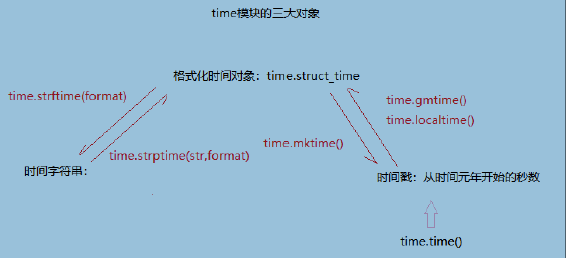

[TOC]


# Python全栈学习（25）内置模块

## 常用内置模块

### random

```python
此模块提供了和随机数获取相关的方法：

- random.random():获取[0.0,1.0)范围内的浮点数
- random.randint(a,b):获取[a,b]范围内的一个整数
- random.uniform(a,b):获取[a,b)范围内的浮点数
- random.shuffle(x):把参数指定的数据中的元素打乱。参数必须是一个可变的数据类型。
- random.sample(x,k):从x中随机抽取k个数据，组成一个列表返回。
                         
eg:
import random
print(random.random())
print(random.randint(2,100))
print(random.uniform(1,2))

lst = [i for i in range(10)]
random.shuffle(lst)
print(lst)

print(random.sample((1,23,14,100,) ,3))
```

### time

```python
封装了获取时间戳和字符串形式的时间的一些方法。
time.time():获取时间戳
time.gmtime([seconds]):获取格式化时间对象:是九个字段组成的
time.localtime([seconds]):获取格式化时间对象:是九个字段组成的
time.mktime(t):时间对象 --transfer-- 时间戳
time.strftime(format[,t]):把时间对象格式化成字符串
time.strptime(str,format):把时间字符串转换成时间对象
    
eg:
import time
print(time.time())
print(time.gmtime(1596445126.8665192))
print(time.localtime(1596445126.8665192))

t1 = time.localtime(1596445126.8665192)
print(time.mktime(t1))

print(time.strftime("%Y-%m-%d %H:%M:%S"))
print(time.strftime("%Y-%m-%d %H:%M:%S", time.localtime(1200)))

print(time.strptime("2018-10-10 14:23:10", "%Y-%m-%d %H:%M:%S"))

'''
1596446532.4223676
time.struct_time(tm_year=2020, tm_mon=8, tm_mday=3, tm_hour=8, tm_min=58, tm_sec=46, tm_wday=0, tm_yday=216, tm_isdst=0)
time.struct_time(tm_year=2020, tm_mon=8, tm_mday=3, tm_hour=16, tm_min=58, tm_sec=46, tm_wday=0, tm_yday=216, tm_isdst=0)
1596445126.0
2020-08-03 17:22:12
1970-01-01 08:20:00
time.struct_time(tm_year=2018, tm_mon=10, tm_mday=10, tm_hour=14, tm_min=23, tm_sec=10, tm_wday=2, tm_yday=283, tm_isdst=-1)
'''

```

time模块三大对象之间的转换关系:

|  |
| ----------------- |
|                   |


### 模块分类

```python
Python语言中，模块分为三类。

    第一类：内置模块，也叫做标准库。此类模块就是python解释器给你提供的，比如我们之前见过的time模块,os模块。标准库的模块非常多（200多个，每个模块又有很多功能），我们这几天就讲常用的十几种，后面课程中还会陆续的讲到。

    第二类：第三方模块，第三方库。一些python大神写的非常好用的模块，必须通过pip install 指令安装的模块，比如BeautfulSoup, Django,等等。大概有6000多个。

    第三类：自定义模块。我们自己在项目中定义的一些模块。
```

### 模块的运行方式

```python
- 脚本方式：直接用解释器执行。或者PyCharm中右键运行。
- 模块方式：被其他的模块导入。为导入它的模块提供资源（变量，函数定义，类定义等）。
```

## 导入 import

### **第一次导入模块执行三件事**

```python
1.创建一个以模块名命名的名称空间。
2.执行这个名称空间（即导入的模块）里面的代码。
3.通过   "模块名."  的方式引用该模块里面的内容（变量，函数名，类名等）。
        
ps：重复导入模块会直接引用内存中已经加载好的结果        
```

#### 导入模块时，如何避免执行模块中的可执行语句

```python
模块 __name__属性的使用

在脚本方式运行时，`__name__`是固定的字符串：`__main__`
在以模块方式被导入时，`__name__`就是本模块的名字

在自定义模块中对`__name__`进行判断，决定是否执行可执行语句：开发阶段，就执行，使用阶段就不执行:
if __name__ == '__main__':
    main()
```


#### **被导入模块拥有独立的名称空间**

每个模块都是一个独立的名称空间，定义在这个模块中的函数，把这个模块的名称空间当做全局名称空间，这样我们在编写自己的模块时，就不用担心我们定义在自己模块中全局变量会在被导入时，与使用者的全局变量冲突。

```python
当前是meet.py

import tbjx.py
name = 'alex'
print(name)
print(tbjx.name)
'''
from the tbjx.py
alex
太白金星
'''

def read1():
    print(666)
tbjx.read1()
'''
from the tbjx.py
tbjx模块： 太白金星
'''

name = '日天'
tbjx.change()
print(name)
print(tbjx.name)
'''
from the tbjx.py
日天
barry
'''
```

### **为模块起别名**

```python
1. 好处可以将很长的模块名改成很短,方便使用
2. 有利于代码的扩展和优化

#mysql.py
def sqlparse():
    print('from mysql sqlparse')
#oracle.py
def sqlparse():
    print('from oracle sqlparse')

#test.py
db_type=input('>>: ')
if db_type == 'mysql':
    import mysql as db
elif db_type == 'oracle':
    import oracle as db
db.sqlparse()
```

### **导入多个模块**

```python
import os,sys,json   # 这样写可以但是不推荐

推荐写法
import os
import sys
import json
```

### **from ... import ...**

#### **from...import... 与import对比**

```python
使用from...import...则是将模块中的名字直接导入到当前的名称空间中，所以在当前名称空间中，直接使用名字就可以了、无需加前缀：

好处：使用起来方便了
坏处：容易与当前执行文件中的名字冲突
```

#### **from...import  一行导入多个模块成员**

```python
from tbjx import read1,read2,name
```

#### **from ... import   \***

```python
#默认情况下，* 表示模块所有的成员都会被导入。

可以在被导入的模块中通过 "__all__" 来控制被导入的 * 的内容：
__all__是一个列表，用于表示本模块可以被外界使用的成员。元素是成员名的字符串。

例子：
__all__=[
    'age',
    'sex'
]

name = "SAge is a good man"
def read():
    print("NO file to read")

age = 19
sex = 'male'


if __name__ == '__main__':
    read()
```


### **模块  循环/嵌套  导入问题**

```python
#创建一个m1.py
print('正在导入m1')
from m2 import y
x='m1'

#创建一个m2.py
print('正在导入m2')
from m1 import x
y='m2'

#创建一个run.py
import m1

#测试一
执行run.py会抛出异常
正在导入m1
正在导入m2
Traceback (most recent call last):
  File "/Users/linhaifeng/PycharmProjects/pro01/1 aaaa练习目录/aa.py", line 1, in <module>
    import m1
  File "/Users/linhaifeng/PycharmProjects/pro01/1 aaaa练习目录/m1.py", line 2, in <module>
    from m2 import y
  File "/Users/linhaifeng/PycharmProjects/pro01/1 aaaa练习目录/m2.py", line 2, in <module>
    from m1 import x
ImportError: cannot import name 'x'


#测试一结果分析
先执行run.py--->执行import m1，开始导入m1并运行其内部代码--->打印内容"正在导入m1"
--->执行from m2 import y 开始导入m2并运行其内部代码--->打印内容“正在导入m2”--->
执行from m1 import x,由于m1已经被导入过了，
所以不会重新导入，所以直接去m1中拿x，然而x此时并没有存在于m1中，所以报错


#测试二:执行文件不等于导入文件，比如执行m1.py不等于导入了m1
直接执行m1.py抛出异常
正在导入m1
正在导入m2
正在导入m1
Traceback (most recent call last):
  File "/Users/linhaifeng/PycharmProjects/pro01/1 aaaa练习目录/m1.py", line 2, in <module>
    from m2 import y
  File "/Users/linhaifeng/PycharmProjects/pro01/1 aaaa练习目录/m2.py", line 2, in <module>
    from m1 import x
  File "/Users/linhaifeng/PycharmProjects/pro01/1 aaaa练习目录/m1.py", line 2, in <module>
    from m2 import y
ImportError: cannot import name 'y'


#测试二分析
执行m1.py，打印“正在导入m1”，执行from m2 import y ，
导入m2进而执行m2.py内部代码--->打印"正在导入m2"，执行from m1 import x，
此时m1是第一次被导入，执行m1.py并不等于导入了m1，
于是开始导入m1并执行其内部代码--->打印"正在导入m1"，
执行from m2 import y，由于m2已经被导入过了，
所以无需继续导入而直接问m2要y，
然而y此时并没有存在于m2中所以报错

# 解决方法:
方法一:导入语句放到最后
#m1.py
print('正在导入m1')
x='m1'
from m2 import y

#m2.py
print('正在导入m2')
y='m2'
from m1 import x

方法二:导入语句放到函数中
#m1.py
print('正在导入m1')
def f1():
    from m2 import y
    print(x,y)

x = 'm1'

# f1()

#m2.py
print('正在导入m2')
def f2():
    from m1 import x
    print(x,y)

y = 'm2'

#run.py
import m1
m1.f1()
```

### **模块的搜索路径**

引用模块也是按照一定规则进行引用，查找模块的顺序是：

**内存中已经加载的模块 -> 内置模块 ->  sys.path 路径中包含的模块**

#### 动态修改 **sys.path** 添加自定义模块

```python
import sys
import os
sys.path.append(os.path.dirname(__file__)+'/test')
from mod1 import *
print(age,sex,name)

'''
os.path.dirname():获取某个文件的父路径。
__file__：显示当前文件的绝对路径+文件名。
'''
```

### 相对导入

```python
#针对某个项目中的不同模块之间进行导入，称为相对导入
相对路径导入只有一种格式：
from 相对路径 import xxx
相对路径：
. 表示的是当前的路径
..表示的是父路径
...表示的是父路径的父路径

'''
父模块
E:\sagepy\env\20200730\test_rel_imp.py
'''
import sys
import os

#sys.path.append(os.path.dirname(__file__)+'/relpro')
#import enter

from relpro.bin import enter
print(enter.age)
print(enter.motion)

'''
子模块，提供入口
E:\sagepy\env\20200730\relpro\bin\enter.py
'''
from ..source.s1 import *  #相对路径导入 模块s1的内容
age = 1
name = "sage"


'''
提供资源的子模块
E:\sagepy\env\20200730\relpro\source\s1
'''
daughter = 'amy'
motion = 'sad'
```


### 模块导入方式小结

```python
# 导入模块的多种方式：

- import xxx:导入一个模块的所有成员,使用方式 “模块名.成员名”
- import aaa,bbb:一次性导入多个模块的成员。不推荐这种写法，分开写。
- from xxx import a:从某个模块中导入指定的成员。
- from xxx import a,b,c:从某个模块中导入多个成员。
- from xxx import *:从模块中导入所有成员。
```

